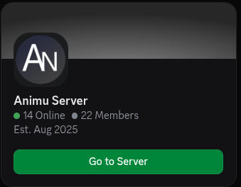
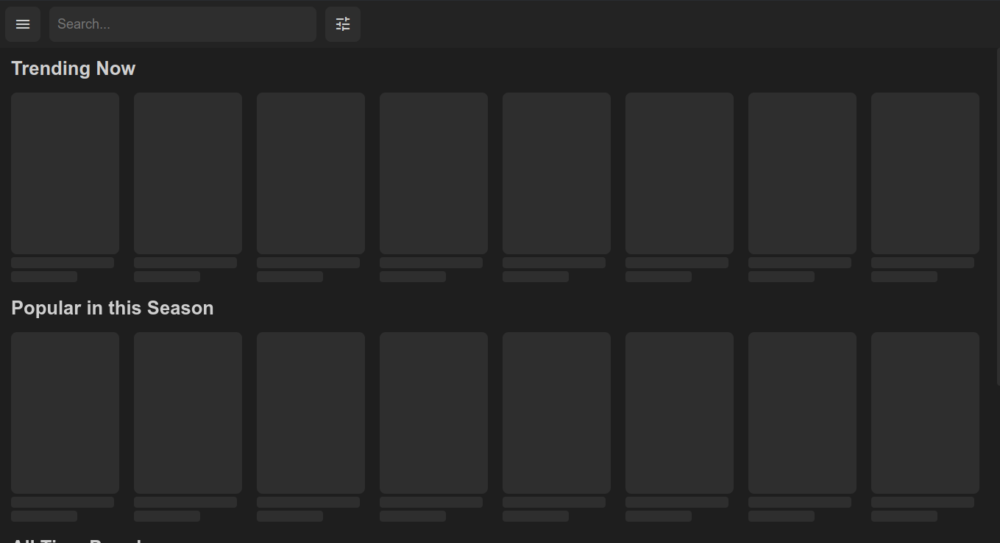
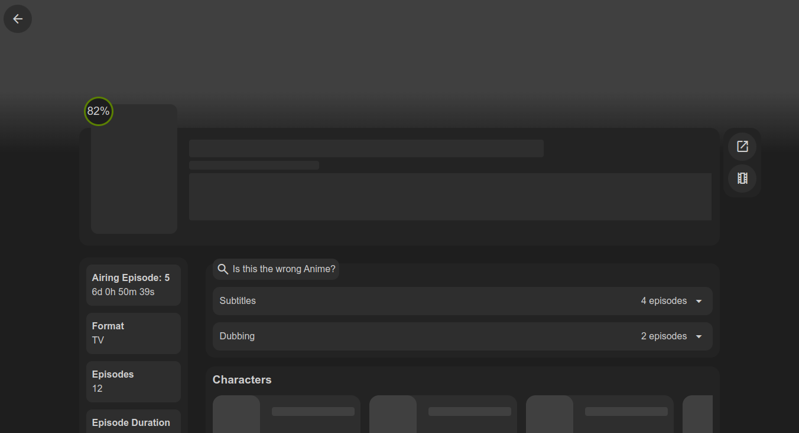

# Animu
The concept is simple: watching anime while having a powerful tool for synchronizing anime lists, downloading anime, tracking what you've watched, using plugins to enable viewing anime from all sites, receiving notifications when a new episode is released on a site, and syncing with anime lists with the ability to update what you've watched, etc.

The only problem is that my friend and I have no experience in creating such a project. So, if anyone wants to help, We have [Discord server](https://discord.gg/p4fTqGKgqr)



## Screenshots



# Planing Features
- [x] Automatic synchronization with platforms like anilist.co via plugins
- [ ] Plugins enabling viewing from various websites
- [x] Saving watch history
- [ ] Downloading anime
- [ ] Notifications when a new episode is released
- [x] User-friendly UI
- [ ] Gamepad Navigation


## How to Compile
You need to have [Node.js](https://nodejs.org/en) installed. Then, clone the repository.
```bash
git clone https://github.com/Owca525/animu.git && cd ./animu
```
Installation of required libraries
```bash
npm install
```
Project compilation
```bash
npm run build:win or build:linux
```
Run developer version
```bash
npm run dev
```

## License

[GPL-3.0](https://choosealicense.com/licenses/gpl-3.0/)
